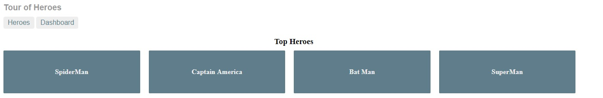
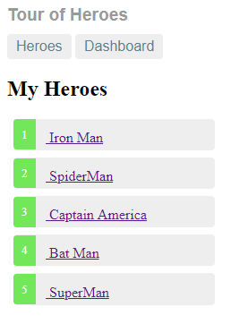
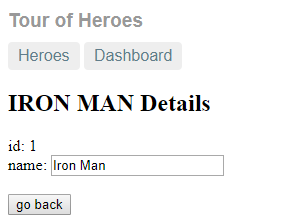
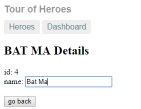
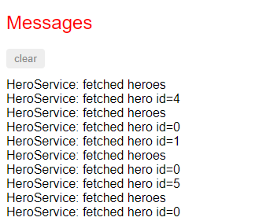

# Angular Basic
Angular basic project given in Documentation at [angular.io](https://angular.io/guide/quickstart)

## Installation
  1. Clone this repositry : `git clone https://github.com/Aktarul/Angular_Basic.git`
  2. Open a terminal in this directory
  3. Navigate to angular-tour-of-heroes directory : `cd angular-tour-of-heroes`
  4. Install dependencies : `npm install --save`
  5. Run the application : `ng serve`
  6. Visit: `localhost:4200`

## UI Design

#### Dashboard

#### Heroes List

#### Heroes Details and Editing Heroes
 .  .  . 

#### Output Messages according to hero selection

